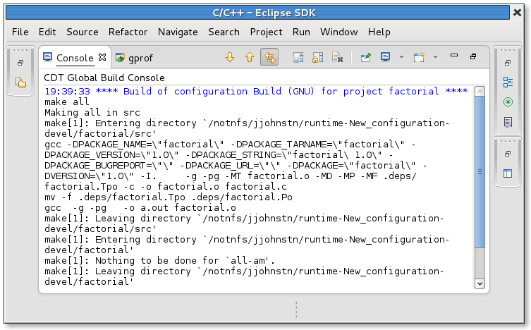
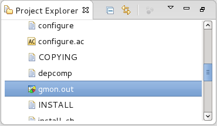
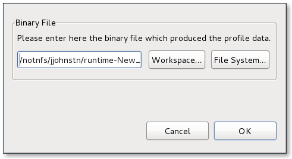
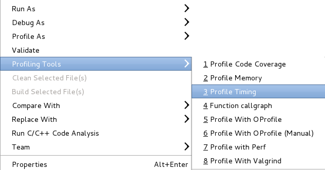
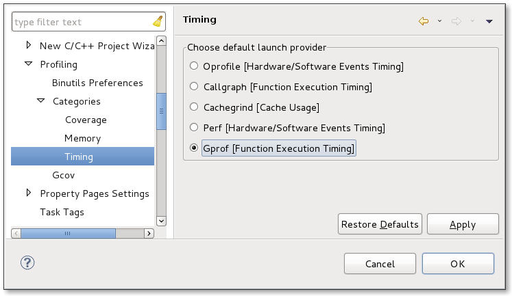
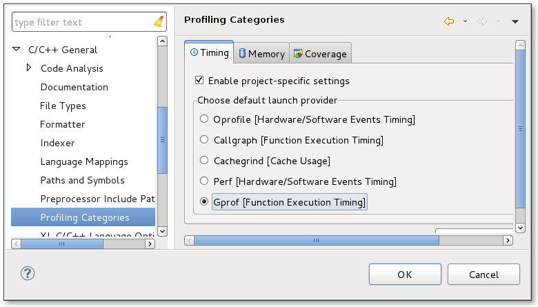
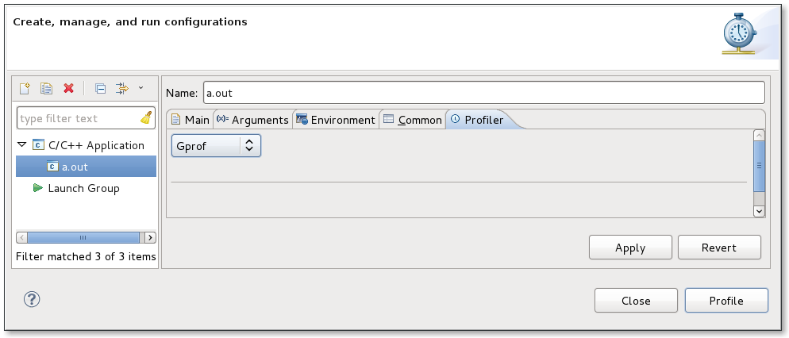
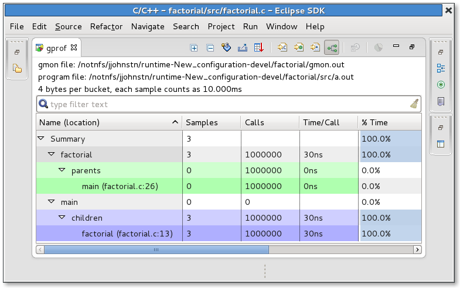

Overview
========

The Gprof plugin allows to visualize in eclipse gprof's output (aka gmon.out).

For more details on gprof, visit the GNU Gprof documentation at <http://sourceware.org/binutils/docs-2.20/gprof/index.html> .

Installation and Set-Up
=======================

Gprof plugin depends on binutils (such as addr2line, c++filt and nm). Gprof can be used on any platform as soon as these binutils are in PATH. For example, you can use it on windows with cygwin.

Older version Configuration pre 3.2.0
-------------------------------------

First of all, the user has to compile the C/C++ program with profiling enabled using the -pg option prior to running the tool. This can be done via the project Properties-\>C/C++ Build-\>Settings-\>Tool Settings-\>GCC C Compiler-\>Debugging tab which has a check-box "Generate Gprof Information (-pg)". A similar check-box can be used for CDT Autotools projects. It is found under project Properties-\>Autotools-\>Configure Settings-\>configure-\>Advanced.

Newer Version Configuration 3.2.\* onwards
------------------------------------------

When the user tires to run gprof for the first time, the user will be asked if he would like eclipse to enable gprof for the user automatically.

This will enable the debug checkbox 'Generate gprof information (-pg)' in the setting shown in the following screenshot:

[none ](File:images/GProfSettings_page_2014.07.17.png "wikilink")

After which the tool will start and generate a new view as the output.

Supported format
================

Up to now, the Gprof plugin supports gmon files generated on:

-   linux (ELF) 32 bits
-   linux (ELF) 64 bits
-   cygwin and BSD: support is not yet complete. See <https://bugs.eclipse.org/bugs/show_bug.cgi?id=333984>
-   powerpc: ongoing. See <https://bugs.eclipse.org/bugs/show_bug.cgi?id=351355>

Opening gmon.out
================

Once the application run is finished, a gmon.out file is generated under the project.

 Double clicking on this file will open a dialog to select the associated binary.

Profiling Using GProf
=====================

Instead of running the application and double-clicking the gmon.out file, you can also just profile the application using the gprof plug-in. This will run the application and display the results for you. To profile using gprof, you can use Profiling Tools-\>Profile Timing and set the timing tool to be gprof.

In preferences, you can also go to: C/C++-\>Profiling-\>Categories-\>Timing and set the default timing tool to be gprof.

or for a project, you can override the workspace preference default using project Properties-\>C/C++ General-\>Profiling Categories-\>Timing

You can also profile your application using Profile as...-\>Local C/C++ Application whereby you have set the profiling tool in the Profiler tab to be gprof.

GProf View
==========

The Gprof view shows which parts of the program consume most of the execution time. It also provides call graph infomation for each function.

 

 Several buttons are available in the toolbar.

-    : "Export to CSV" button allows you to export the gprof result as a CSV text file, suitable for any spreadsheet.
-    : "Sort samples per file" button displays gprof result sorted by file.
-    : "Sort samples per function" button displays gprof result sorted by function.
-    : "Sort samples per line" button displays gprof result sorted by line.
-    : "Display function call graph" button displays gprof result as a call graph.

-    : "Switch samples/time" button allows you to switch result display from samples to time and vice-versa.
-    : "Create Chart..." button allows you to create a BIRT chart, with the current lines selected in the gprof result view.

 If program is compiled with debug option (e.g. "-g"), double-clicking on a item in the result will open the corresponding source location.

Troubleshooting
===============

If you encounter a problem with the gprof plugin, please open an issue: <https://github.com/eclipse-linuxtools/org.eclipse.linuxtools/issues/new/choose>
